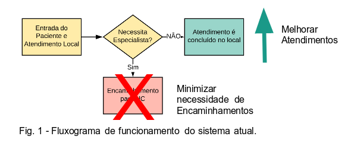
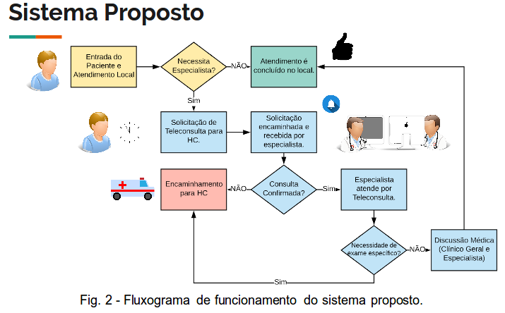

# Telemedicina
Códigos relacionados a disciplina de Telemedicina do curso de Eng. Biomédica da Universidade Federal de Uberlândia (UFU).

## Sistema de Teleconsulta voltada a especialistas

### Definição do problema:
Falta de especialistas
* São 3 clínicos gerais, estando sempre um presente no estabelecimento.
* Não há nenhum profissional especialista.
* O estabelecimento estudado necessita encaminhar todos os atendimentos que requerem especialistas.

### Implicações
A falta de médicos especialistas implica que:
* Haverá um maior número de encaminhamentos, pois somente as enfermidades gerais poderão ser resolvidas.
* Cada encaminhamento gera um gasto.
* Os pacientes podem sair prejudicados devido aos encaminhamentos.
* Caso seja utilizada a ambulância disponível para o transporte de um paciente para o HC, ela não estará disponível durante o tempo de viagem, podendo haver complicações.
* Em casos graves, um encaminhamento pode significar a diferença entre a vida e a morte.
* Distância e problemas na comunicação entre profissionais de instituições diferentes (ANDO, 2011).

### Hipótese
* Possibilidade de reduzir os encaminhamentos para consulta com especialistas
* Liberação de vagas dentro da cota de transporte
* Possível redução do tempo de atendimento em casos especialistas
* Melhorar qualidade nos atendimentos com problemas específicos

### Sistemas Existentes
* Sistema GERCON.
  * Implantado pela UFRGS, possibilita interferência de um grupo  de médicos.
* Instituição IDTECH.
  * Empresa de desenvolvimento e pesquisa de tecnologia.
* Aparecida de Goiânia.
  * Sistema de agendamento por telefone (IDTECH responsável) .
* NetConsulta.
  * permite agendamento de consulta não emergencial pela Internet e smartphone (IDTECH responsável).

### Nossa Proposta: Sistema de Solicitações de Teleconsulta
Proposta de um sistema de solicitação de consulta que possibilite:
* Solicitação de consultas de urgência e prioritárias.
* Acompanhamento da consulta pelo médico geral e especialista para trabalho conjunto.
* Realização de consultas no próprio Posto Médico.
* Evitar o transporte para consulta com médicos especialistas.

### Características do Sistema Proposto
* Baseado no sistema GERCON.
* Retirar intervenção de grupo médicos avaliadores.
* Sistema poderá ser utilizado para atendimento rápido, ou para marcar um atendimento.
* Comunicação direta PM com HC.
* Aviso direto de solicitação no smartphone do especialista plantonista.
* Sistema de teleconferência próprio.

### Possíveis  Desafios e Dificuldades
Para funcionar é preciso garantir:
* Conexão de vídeo com qualidade e estável.
* Solicitações sejam recebidas e atendidas.
* Adequação a legislação vigente sobre teleconsulta.
* Segurança da informação.
É preciso ainda, verificar a necessidade de armazenamento de dados do paciente.

### Referências
* UFRGS. Como funciona o processo de encaminhamento para consulta especializada? Disponível em:<https://www.ufrgs.br/telessauders/noticias/como-funciona-o-processo-de-encaminhamento-para-consulta-especializada/> Acesso em: 21 abr 2018.
* ANDO, Nilson Massakazu et al. DECLARAÇÃO DE BRASÍLIA" O Conceito de rural e o cuidado à saúde". Revista brasileira de medicina de familia e comunidade, v. 6, n. 19, p. 142-144, 2011.
* A REDAÇÃO. Prefeitura de Aparecida retoma agendamento de consultas por telefone. Disponível em:<http://www.aredacao.com.br/noticias/8212/prefeitura-de-aparecida-retoma-agendamento-de-consultas-por-telefone> Acesso em: 22 abr 2018.

## Autores

* Ítalo G. S. Fernandes
* Lucas L. Franco
* Mariane M. Oliveira
* Nathalia Rodrigues
* Paulo Camargos
